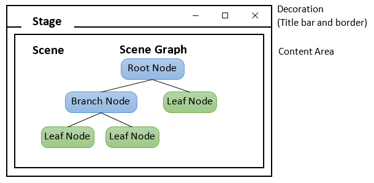

# Java-Lab-011 - Graphical User Interfaces

## There are 3 main GUI libraries in Java:

1. JavaFX: Currently the most modern GUI that is still under development.
2. Java Swing: A widely used GUI library with lots of components and historically popular projects.
3. Java AWT: The firs Java GUI library with some useful components, but not widely used or popular today.

### We are going to be using JavaFX because:
* JavaFX is easier to use.
* Provides one API for client functionality
    * GUI
    * Graphics
    * Multimedia
* Gives complete control over Look-and-Feel with CSS selectors
* Better Threading support
* Uses accelerated graphics hardware (GPUs)
* Supports repositioning
* Provides upgrade paths to Swing and AWT
* Most importantly, it can also be used to build pure Java **mobile** applications
    * That will not be our focus today.

## JavaFX WYSIWYG - Scene Builder

[Download JavaFX Scene Builder](https://gluonhq.com/products/scene-builder/)

* Allows you to drag and drop **layouts** and **controls**
* Saves those layouts and controls in **FX Markup Language** AKA fxml, which is really just an XML document defining GUI objects to be created in code.

### JavaFX and Scene Builder Structure
* javafx.stage.Stage class: represents the top-level container.
* javafx.scene.Scene class: contains individual controls (or components).
* Applications can have many scenes, but only one can be displayed on the stage at a time.
* A **Hierarchical Graph** of javafx.scene.Node classes represents a scene content.

* Basic UI Construction:
    * Prepare a scene graph.
    * Construct a scene, with the root node of the scene graph.
        * Root node is often a layout node
        * javafx.scene.Parent is a subclass of javafx.scene.Node, and serves as the base class for all nodes that have children in the scene graph.
    * Setup the stage with the constructed scene.

```java
@Override
public void start(Stage stage) throws Exception {
//Parent root = FXMLLoader.load(getClass().getResource("algsimulator.fxml"));
Parent root = FXMLLoader.load(Objects.requireNonNull(getClass().getResource("algsimulator.fxml")));

Scene scene = new Scene(root);
stage.setTitle("AlgorithmSimulation Simulator");
stage.setScene(scene);
stage.show();
}
```

### Read More about JavaFX Structure in the References Below
[Reference to JavaFX Structure](https://www3.ntu.edu.sg/home/ehchua/programming/java/Javafx1_intro.html#zz-2.2)

### Instructor Demo of Scene Builder Controller Linkage

## Part 1 - Use Scene Builder to Build a GUI for MergeSortSimulation
* First open binarySearchControls.fxml in scene builder and explore how it is set up.
* Now create a new Scene Builder Project and define a similar GUI interface for mergeSortControls.fxml
* Save it to the same file system location as binarySearchControls.fxml (i.e. resources/edu/redwoods.cis12)

## Part 2 - Modify the MergeSortSimulation Class to Load your New GUI
* See the BinarySearchSimulation and BinarySearchSimulationController for an example.

## Part 3 - Implement the MergeSortSimulation Algorithm
* Referencing LinearSearchSimulation and BinarySearchSimulation, try to implement the MergeSortSimulation algorithm.
